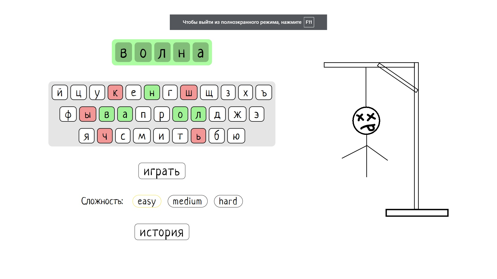
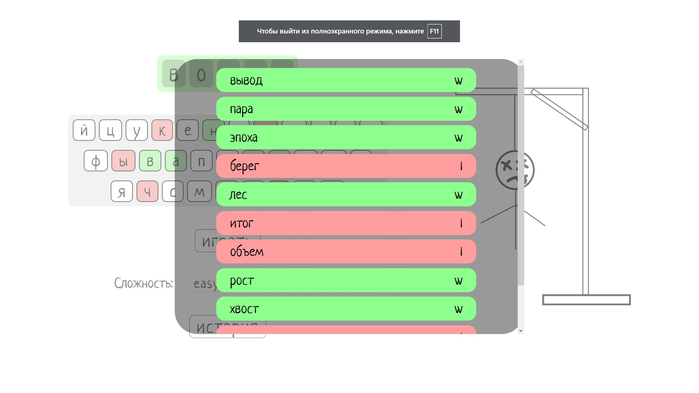

<h1>Виселица</h1>

Простая игра, сделанная на нативном JS

- для корректной работы требуется json-server, так как скрипт берет данные из db.json

- перед началом каждой игры доступен выбор сложности (от него зависит длина слова)

- в localStorage сохраняется история игр, которую можно посмотреть, нажав на "история"

